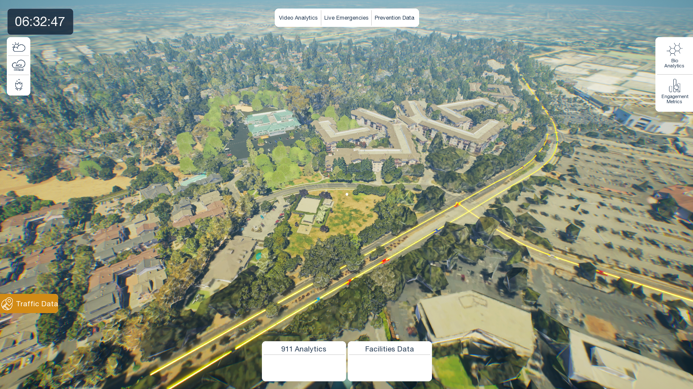

# 🏫 CHS School – Traffic Simulation & Planning Digital Twin

Transforming urban traffic simulation and planning with a **real-time interactive platform**, the **CHS School – Traffic Simulation & Planning Digital Twin** delivers **immersive geospatial accuracy** combined with **live traffic dynamics** to provide **superior insights** for **urban design and mobility management**.  

What if every street's **traffic flow and congestion** could be **viewed and analyzed in a vivid 3D environment** perfectly aligned with **real-world coordinates**?  
What if planners leveraged **real-time traffic data** to power **dynamic simulations**, enabling **smarter decisions**?  

This project integrates **live TomTom API data**, **custom 3D models**, and **verified GIS terrain data** to realize that vision.  

---

[▶ Watch Demo Video](https://drive.google.com/file/d/1qH_x7LHmhjYMSdPblKwU4W26nI_AYxIN/view?usp=drive_link)

---

## 📑 Contents
- [🌍 What This Tool Actually Does](#-what-this-tool-actually-does)  
- [🔄 How We Actually Built This Thing](#-how-we-actually-built-this-thing)  
- [🎮 Interactive Features](#-interactive-features)  
- [📊 Monitoring Panels](#-monitoring-panels)  
- [🧰 Technology Stack](#-technology-stack)  
- [✅ Outcome](#-outcome)  
- [🔐 Data Privacy & Security](#-data-privacy--security)

---

## 🌍 What This Tool Actually Does
This platform visualizes **vehicle movements, congestion heatmaps, and urban layouts** with **precise georeferencing** to enable **real-time traffic management** and **urban planning analysis**.  

It merges:  
- Custom building models  
- GIS basemaps  
- Live traffic inputs  

➡️ All simulated within **Unreal Engine** across a **geospatially accurate terrain**.  

---

## 🔄 How We Actually Built This Thing
1. **Data Acquisition** → Collected **live TomTom traffic data** & **GIS basemaps**; verified building details via **Google Street View** & site footage  
2. **3D Modeling** → Created **architecturally accurate school buildings**; imported surrounding **urban context from GIS**  
3. **GIS Data** → Exported **georeferenced basemap layers** (buildings, roads, environmental textures)  
4. **Unreal Engine Setup** →  
   - Initialized a blank project template with GIS plugins to handle geospatially referenced data.
   - Added **foliage elements** (grass, trees, shrubs) to enhance realism and provide natural environmental context
   - Built **roads with spline blueprints**
   - Integrated **live TomTom vehicle data**  
   - Visualized congestion with **red-yellow-green spline gradients**  
5. **Interactive Features** → Enabled toggling of **real-time traffic**, layered visualization, and dynamic planning workflows  
6. **UI & Development** → Built an **interactive UI system** with intuitive controls  
7. **Monitoring Panels** → Embedded live dashboards for **Air Quality Index, Flood Zones, and Pollen Index**  
8. **Testing & Debugging** → Iterative testing to validate data accuracy and interaction fidelity (this is to be executed as per real time project deployment)
9. **Deployment** → Packaged as a **Windows build/Pixel Streaming**, optimized for performance  

---

## 🎮 Interactive Features
- **Location Bookmarks**  
  - Dynamic world-space markers  
  - Scale with distance  
  - Always face the camera  
  - Enable **smooth navigation** when selected  

---

## 📊 Monitoring Panels
- **Air Quality Index Panel** → Tracks universal & local air quality with **visual heatmaps**  
- **Pollen Index Panel** → Displays **live pollen levels** (tree, grass, weed) with severity indicators  
- **Flood Zone Panel** → Visualizes **real-time flood impact zones** for proactive safety  

---

## 🧰 Technology Stack

### 🔹 Backend
- Real-time traffic data via **TomTom APIs**  
- Geospatial basemaps from **GIS**  
- Terrain capture & refinement with **RenderDoc** & **Blender**  

### 🔹 Frontend
- Visualization & simulation → **Unreal Engine with GIS plugins**  
- 3D modeling tools → **Blender, GIS exports** (asset creation pipeline)  
- UI development → **Unreal Blueprints**  

---

## ✅ Outcome
- **Backend** → Data acquisition & processing (TomTom API, GIS basemaps, terrain refinement)  
- **Frontend** → Real-time **visualization, simulation, and UI** built in **Unreal Engine** using **Blueprints**  
- **3D modeling tools** → Bridge asset creation & visualization environment  

👉 The result: A **comprehensive, GIS-aligned traffic simulation and planning tool** providing **immersive insights for real-world applications**.  

---

## 🔐 Data Privacy & Security
Our **data handling approach** prioritizes **client data sovereignty** through:  
- **On-premises deployment**  
- **Comprehensive security controls**  
- **Transparent operational practices**  

All solutions operate **within client infrastructure**, ensuring:  
- Complete **data ownership and control**  
- Maintenance of **enterprise-grade security standards** throughout the **project lifecycle**

---
